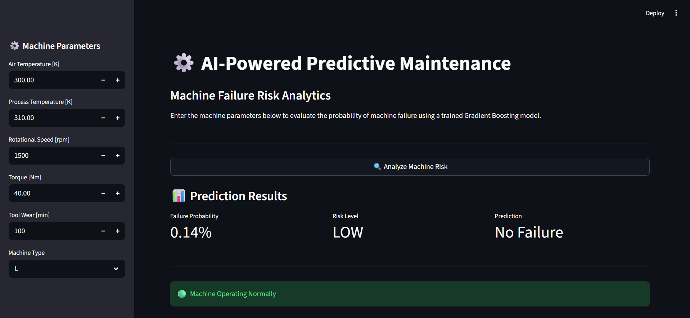
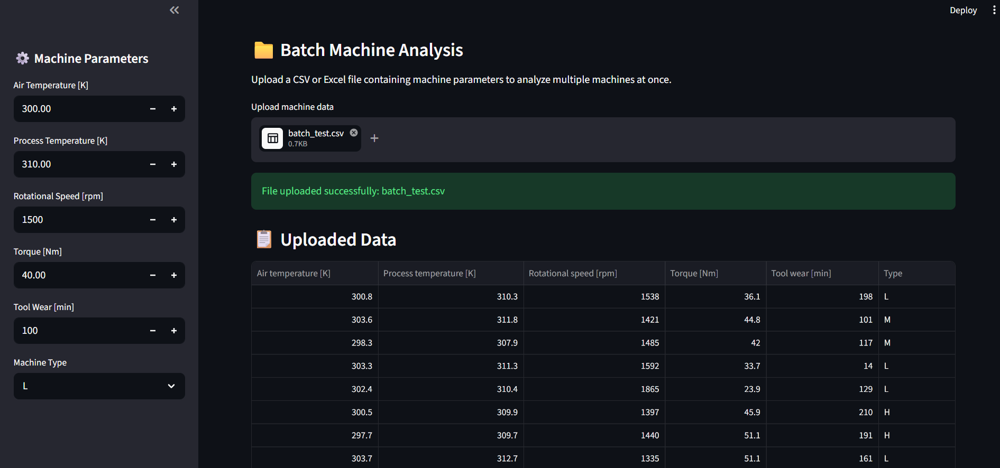
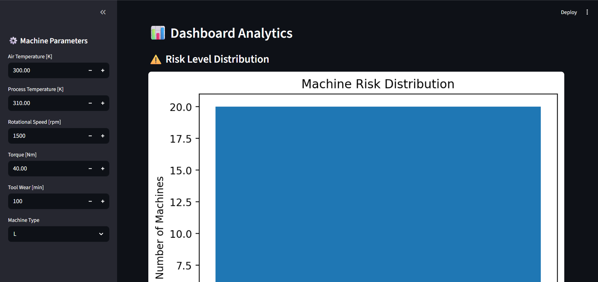
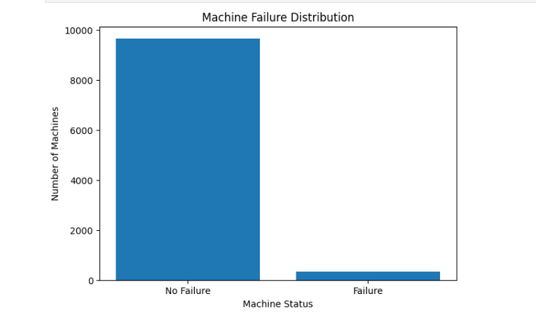
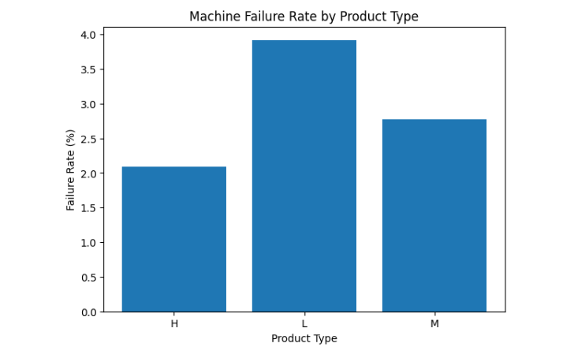
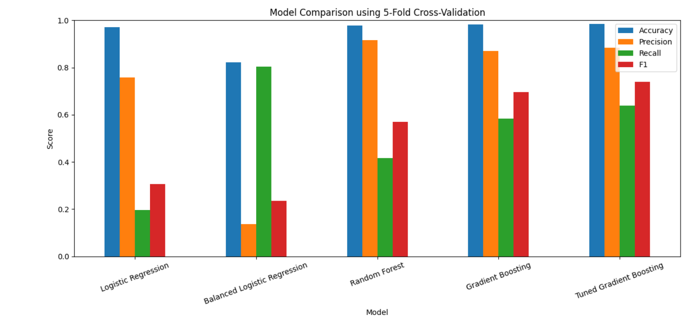
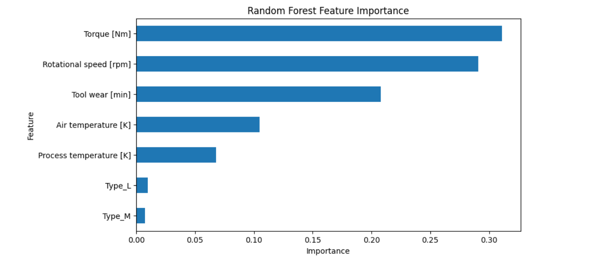
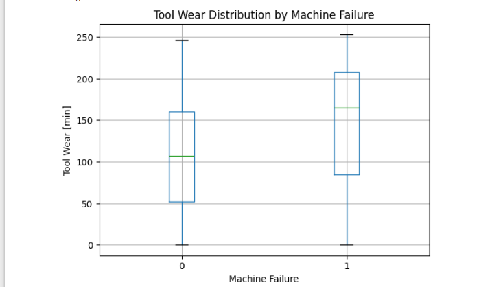
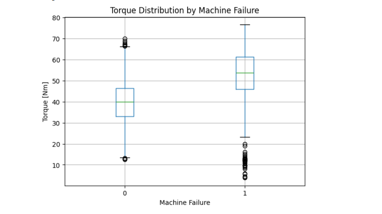

# AI-Powered Predictive Maintenance & Risk Analytics Dashboard

An AI-powered predictive maintenance system that uses machine learning to predict machine failure risk based on operational parameters.

The project includes an interactive Streamlit dashboard for single-machine prediction, batch analysis, risk analytics, and model performance visualization.

---

## 🚀 Dashboard Preview

### 🔍 Single Machine Risk Prediction

Enter machine parameters and receive the predicted failure probability, risk level, prediction result, and maintenance status.



---

### 📁 Batch Machine Analysis

Upload a CSV or Excel file containing multiple machine records and analyze all machines at once.



---

### 📊 Dashboard Analytics

Visualize machine risk distribution and analyze prediction results.



---

## 📌 Features

- Single Machine Failure Prediction
- Failure Probability Estimation
- Risk Level Classification
- Machine Status Detection
- Batch Analysis using CSV or Excel files
- Batch Prediction Results
- Failure Rate Analysis
- Risk Level Distribution
- Feature Importance Visualization
- Model Performance Metrics
- Downloadable Prediction Results

---

## ⚙️ Machine Parameters

The model uses the following machine parameters:

- Air Temperature [K]
- Process Temperature [K]
- Rotational Speed [rpm]
- Torque [Nm]
- Tool Wear [min]
- Machine Type (L, M, H)

---

# 🤖 Machine Learning

Several classification models were evaluated during the project:

- Logistic Regression
- Balanced Logistic Regression
- Random Forest
- Gradient Boosting
- Tuned Gradient Boosting

The final selected model is a **Tuned Gradient Boosting Classifier**.

### Best Model Configuration

- Learning Rate: `0.05`
- Max Depth: `4`
- Number of Estimators: `200`

---

## 🏆 Final Model Performance

| Metric | Score |
|---|---:|
| Accuracy | 98.47% |
| Precision | 88.29% |
| Recall | 63.84% |
| F1 Score | 73.97% |

---

# 📊 Exploratory Data Analysis

The following visualizations were created during the data exploration and model development process.

### Correlation Heatmap


### Machine Failure Distribution



### Machine Failure Rate by Product Type



### Model Comparison using 5-Fold Cross-Validation



### Random Forest Feature Importance



### Tool Wear Distribution by Machine Failure



### Torque by Machine Failure



---

# 🔍 Feature Importance

Feature importance analysis showed that **Torque [Nm]** is the most influential feature for predicting machine failure.

Other important factors include:

- Rotational Speed
- Tool Wear
- Process Temperature
- Air Temperature
- Machine Type

---

# 📁 Project Structure

```text
AI-Predictive-Maintenance/
│
├── images/
│   ├── dashboard.png
│   ├── batch_analysis.png
│   ├── dashboard_analytics.png
│   ├── correlation_heatmap.png
│   ├── machine_failure_distribution.png
│   ├── machine_failure_rate_by_product_type.png
│   ├── model_comparison_using_5_fold_cross_validation.png
│   ├── random_forest_feature_importance.png
│   ├── tool_wear_distribution_by_machine_failure.png
│   └── torque_by_machine_failure.png
│
├── 01_data_exploration.ipynb
├── app.py
├── batch_test.csv
├── feature_names.pkl
├── tuned_gradient_boosting_model.pkl
├── requirements.txt
└── README.md
